# Introducción y novedades de Jakarta EE 8

El objetivo del presente tutorial es brindar una demostración de algunas de las novedades más importantes de Java EE 8, especificamente:

* Retrocompatibilidad
* JAX-RS 2.1 Reactive client
* JSON Binding
* JSON-P (Processing y Patching)
* CDI 2.0 (Async events)

El tutorial esta dividido en 5 secciones:

1. Configuración e instalación de un entorno de desarrollo Java EE 8
2. Creación y despliegue de una aplicación con Java EE 7
3. Actualización de la aplicación de Java EE 7 a Java EE 8
4. Implementación de nuevas características en Java EE 8
5. Extensiones populares en Java EE 8 -e.g. DeltaSpike, Eclipse MicroProfile-

Como referencia se ha creado un repositorio de demostración con cada uno de los pasos delimitados mediante commits de Git en [https://github.com/tuxtor/jmovies](https://github.com/tuxtor/jmovies)

## Configuración e instalación de un entorno de desarrollo Java EE 8

### Instalación de NetBeans 
Como primer paso debemos descargar el [instalador de NetBeans](https://netbeans.org/downloads/) correspondiente a nuestro sistema operativo, específicamente la versión para Java EE.

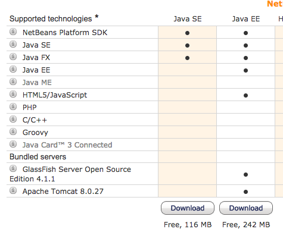

Dado que el instalador esta pensado para todo publico, el mismo funciona como un asistente con una serie de pasos donde el usuario debe confirmar licencia, directorio de instalación y en el caso del instalador para Windows y Linux también se ofrecen como opciones la instalación de Tomcat y Glassfish 4.

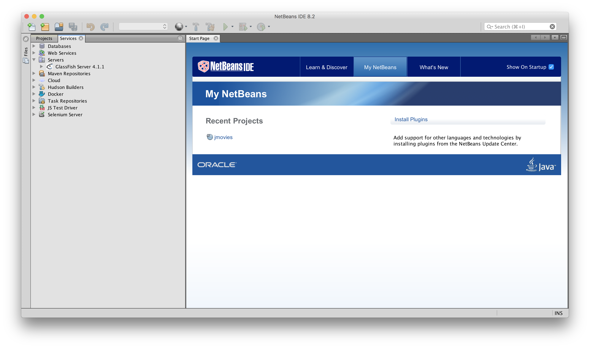

### Instalación de Payara

Luego de instalar NetBeans deberemos [descargar Payara](https://www.payara.fish/downloads). Como en la mayoría de servidores de aplicaciones, se distribuye al publico un Zip que contiene todo lo necesario para ejecutar nuestra instalación:

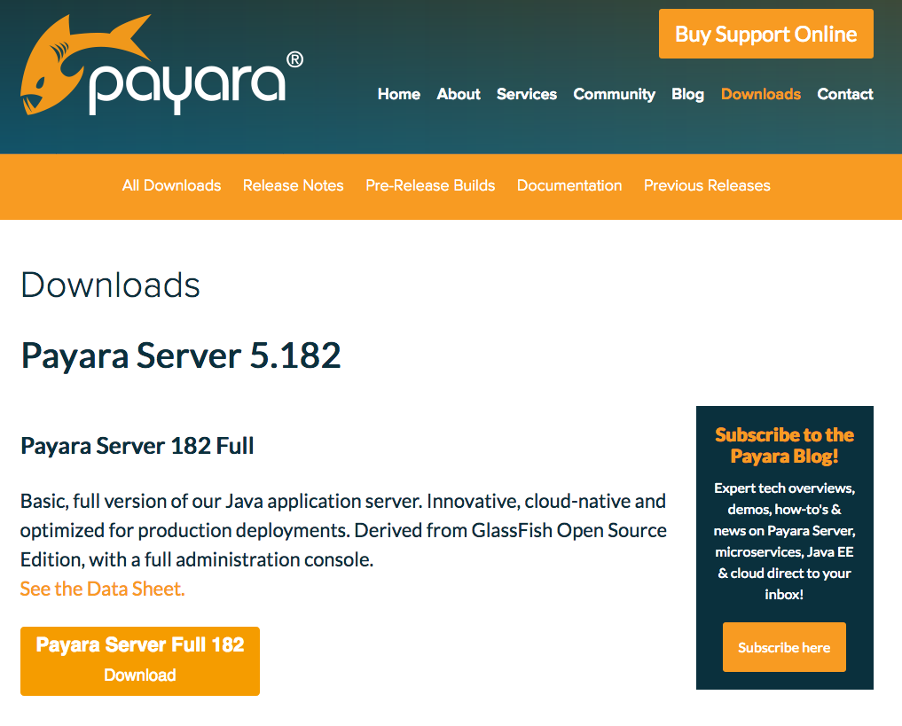

Al momento de escribir este tutorial, la ultima versión disponible al publico es la versión 5.182 la cual generara un archivo denominado `payara-5.182.zip`, para "instalarlo" basta con descomprimir el archivo y recordar la ruta. En el caso de Windows y para evitar inconvenientes de permisos, se recomienda instalarlo en un directorio propiedad del usuario -e.g. Documentos-.

### Instalación de plugins de Payara

Para dar soporte a Payara en nuestra instalación de NetBeans, deberemos descargar los plugins de Payara desde [NetBeans Plugins Portal](http://plugins.netbeans.org/plugin/72263/payara-server), como resultado obtendremos un archivo zip `1529324925_PayaraPlugins_1.3` que contendrá cinco archivos con extensión .nbm correspondientes a los complementos de Payara.

Luego, en la sección de plugins de NetBeans (Tools -> Plugins), debemos agregar nuestros complementos recién descargados (en la pestaña Downloaded):
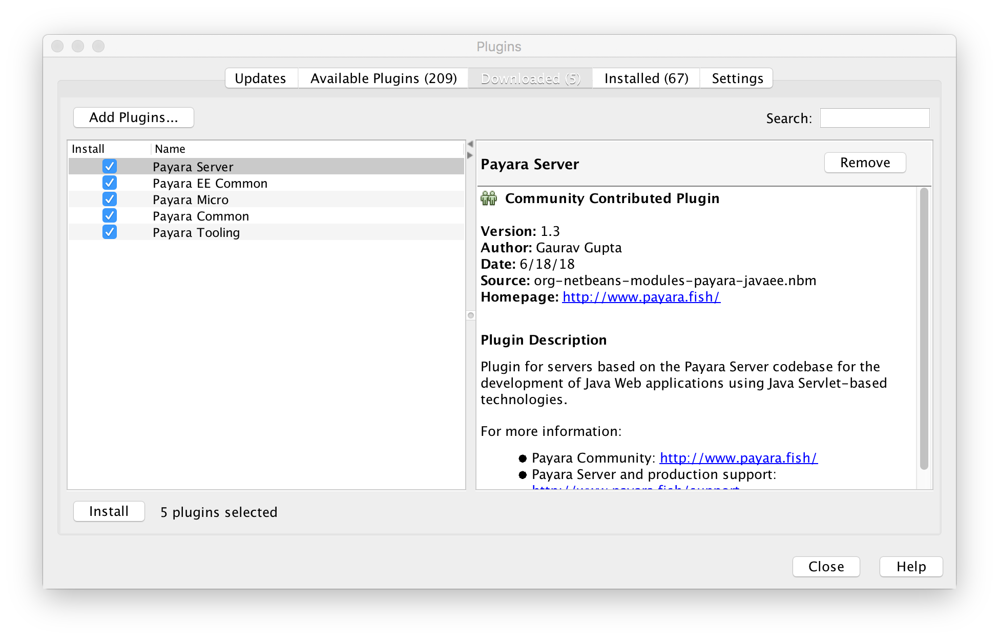

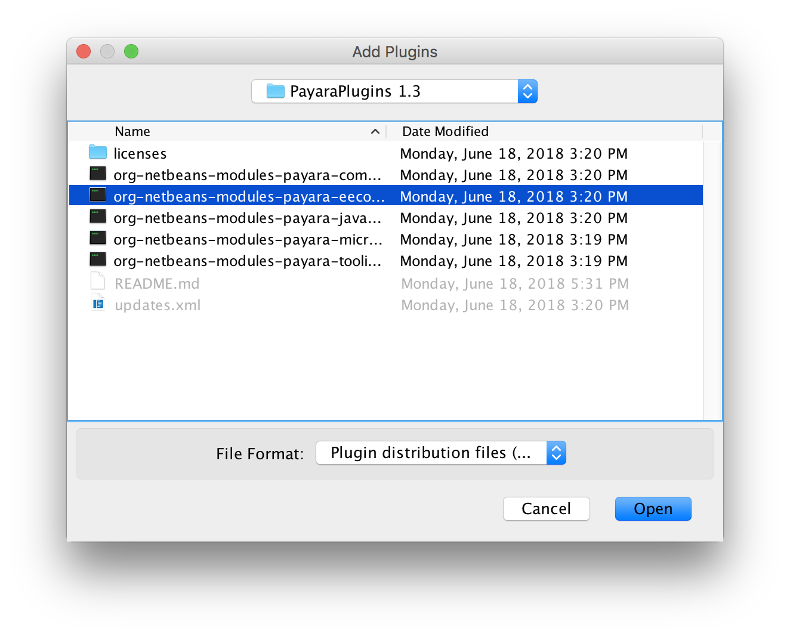

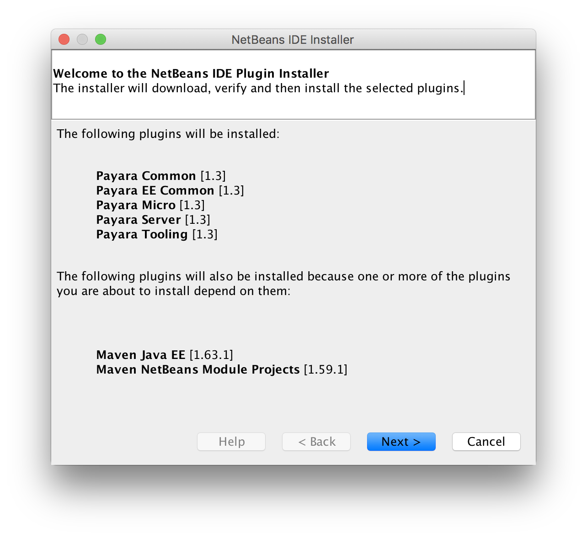

Al finalizar NetBean solicitara el reinicio del IDE.

### Conexión de NetBeans con Payara

Al reiniciar el IDE, debemos movilizarnos hacia la pestaña Services, específicamente en el apartado Servers, y mediante click derecho seleccionaremos la opción "Add Server".

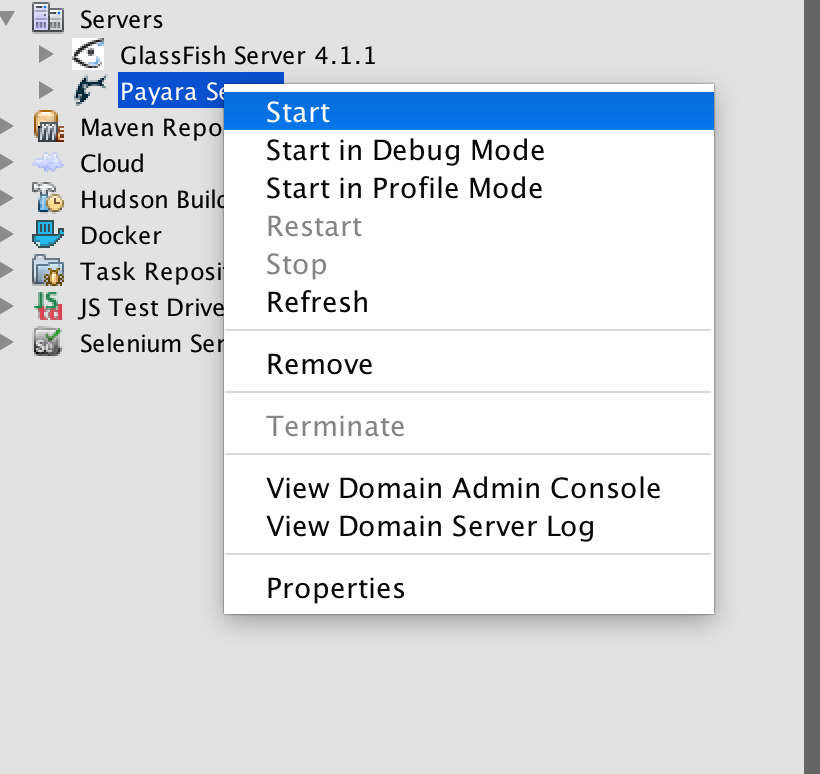

Luego, debemos elegir Payara Server para tener soporte a la ultima versión de Payara.

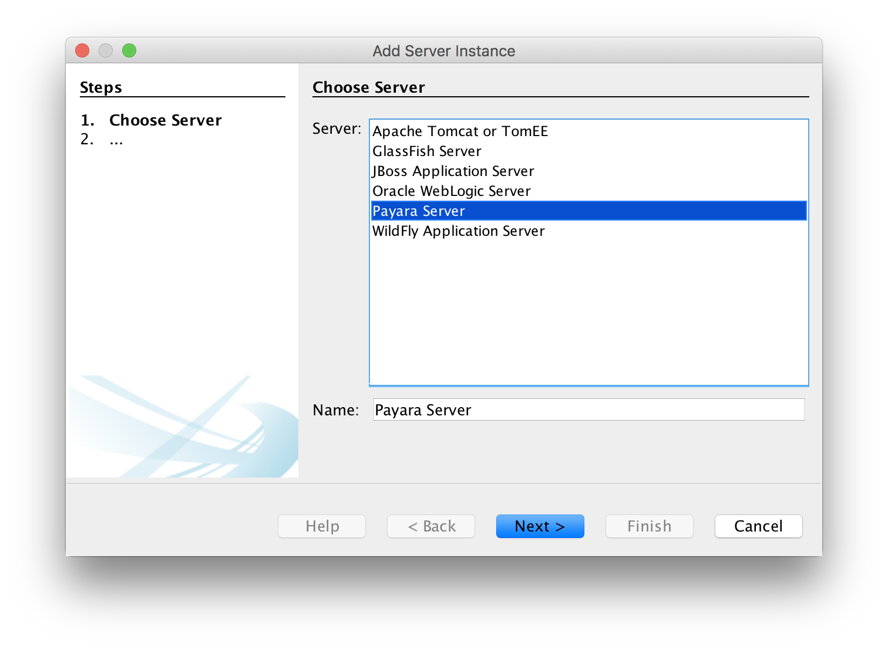

Ubicamos la ruta donde hemos descomprimido nuestro archivo zip de Payara

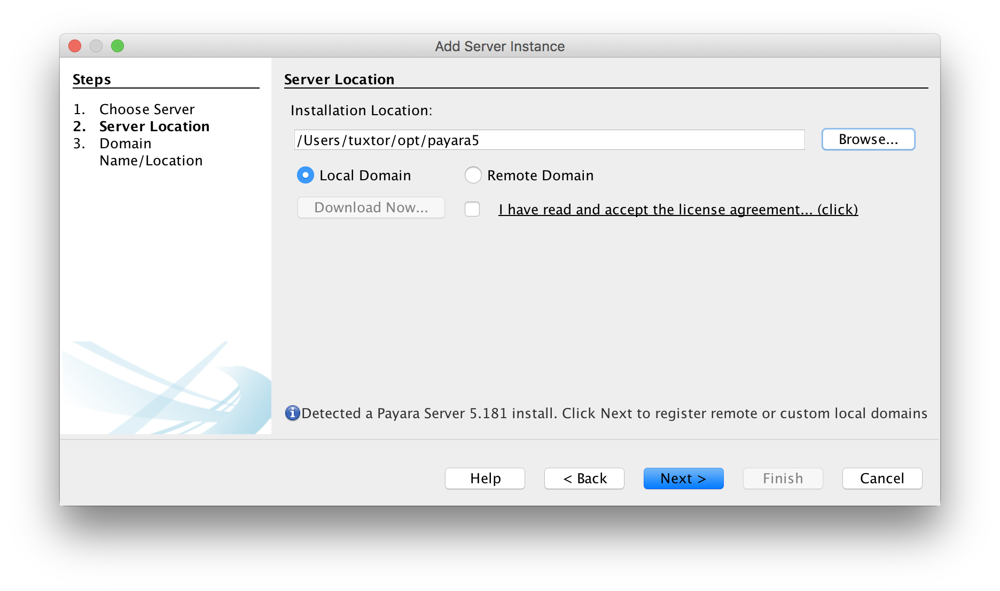

Utilizaremos los valores predeterminados para dominio

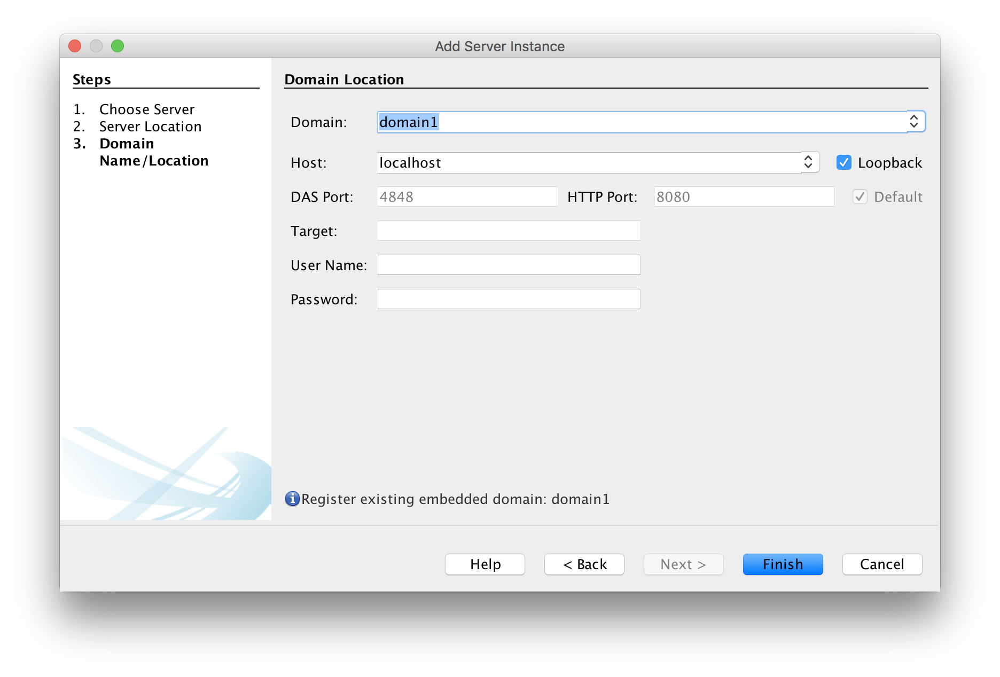

Al finalizar, estaremos listos para iniciar Payara por primera vez, si la instalación es satisfactoria podemos dirigirnos hacia la url http://localhost:8080 donde Payara debe estar en ejecución:

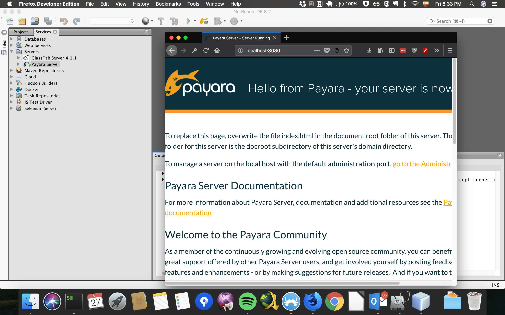

## Creación y despliegue de una aplicación con JavaEE 7

Para la siguiente demostración crearemos una aplicación web utilizando Netbeans IDE 8.2 de acuerdo al siguiente esquema:

El objetivo de la aplicación es la elaboración de un backend para aplicaciones SPA (para fines demostrativos el [siguiente repositorio contiene una aplicación en AngularJS](https://github.com/tuxtor/jmovies-spa)), con la cual podremos crear un listado de películas favoritas, para agregar, modificar y eliminar películas (CRUD).

### Creando el proyecto

Como primer paso debemos agregar un nuevo proyecto de tipo **Web Application** para *Maven* web Java EE, por defecto NetBeans 8.2 genera una aplicación compatible con Java EE 7 en el perfil web, se incluyen screenshots de referencia de una nueva aplicación denominada *jmovies* mediante los cuales se 1- selecciona el proyecto, 2- se establecen los datos del proyecto en Java y 3- se selecciona el entorno de ejecución:

#### Selección de tipo de proyecto


#### Creación de proyecto


#### Selección de entorno de ejecución


Por ultimo, configuraremos nuestro proyecto para dar soporte a Java 8. Para esto, debemos abrir el archivo pom.xml en el cual se encuentran las definiciones de dependencias y tareas para la construcción de nuestro proyecto. Al abrirlo, debemos reemplazar las lineas:

```xml
<source>1.7</source>
<target>1.7</target>
```

Por

```xml
<source>1.8</source>
<target>1.8</target>
```

### Creando la capa de persistencia de datos

En esta ocasión utilizaremos una entidad en Java que representa una tabla relacional de base de datos, para esta demostración utilizaremos [Apache H2](http://www.h2database.com/html/main.html), el cual se encuentra disponible en Payara 5.  

Como parte del estandard de Java EE, los servidores de aplicaciones deben implementar una base de datos relacional en memoria que permita elaborar pruebas, demostraciones y servir de soporte para procesos de integración continua. Sobre esta capa utilizaremos tres APIs fundamentales en las aplicaciones de JavaEE:

* JPA: ORM y mecanismo de mapeo desde bases de datos relacionales hacia el paradigma orientado a objetos
* EJB: Para la creación de componentes con una arquitectura orientada a servicios, incluyendo transaccionalidad, manejo de ciclo de vida e inyección de dependencias
* Bean Validation: Validaciones declarativas para la integridad de nuestra aplicación

#### Creando la entidad de persistencia

La primera vez que ejecutemos nuestra aplicación notaremos que no existe una estructura de base de datos y la misma sera creada en base a una entidad Java, abordaje denominado "code first".

Como primer paso debemos activar JPA en nuestro proyecto mediante la adición de un archivo de configuración estandard, específicamente *persistence.xml* mediante el cual crearemos una **unidad de persistencia** denominada `jmovies_PU`. Las unidades de persistencia son las encargadas de vincular la conexión hacia una base de datos relacional para poder utilizar el recurso mediante inyección de dependencias en código Java.

Para esto, debemos crear el archivo en `src/main/resources/META-INF/persistence.xml` con el siguiente contenido:

```xml
<?xml version="1.0" encoding="UTF-8"?><persistence xmlns="http://xmlns.jcp.org/xml/ns/persistence" xmlns:xsi="http://www.w3.org/2001/XMLSchema-instance" version="2.1" xsi:schemaLocation="http://xmlns.jcp.org/xml/ns/persistence http://xmlns.jcp.org/xml/ns/persistence/persistence_2_1.xsd">
  <persistence-unit name="jmovies_PU" transaction-type="JTA">
    <exclude-unlisted-classes>false</exclude-unlisted-classes>
    <properties>
      <property name="javax.persistence.schema-generation.database.action" value="drop-and-create"/>
      <property name="javax.persistence.schema-generation.scripts.action" value="drop-and-create"/>
      <property name="javax.persistence.schema-generation.scripts.create-target" value="jmoviesCreate.ddl"/>
      <property name="javax.persistence.schema-generation.scripts.drop-target" value="jmoviesDrop.ddl"/>
    </properties>
  </persistence-unit>
</persistence>
```

Note que al utilizar la unidad de persistencia por defecto, no es necesario seleccionar un origen JTA.

Una vez lista la unidad de persistencia, agregaremos una nueva entidad en Java denominada `Movie` cuyas propiedades representan las columnas de una tabla en base de datos relacional, las anotaciones en Java representan metadatos que indican las restricciones que aplican para cada una de las columnas -e.g. sin nulos, tamaño máximo-.

* imdb(codigo): String
* nombre: String
* descripcion: String


```java
@Entity
@XmlRootElement
public class Movie implements Serializable {

    @Id
    @GeneratedValue(strategy = GenerationType.AUTO)
    @Column(name = "id", updatable = false, nullable = false)
    private Long id;
    private static final long serialVersionUID = 1L;
    @Version
    @Column(name = "version")
    private int version;

    @Column
    @NotNull
    private String nombre;

    @Column
    @Size(max = 2000)
    private String descripcion;

    @Column
    @NotNull
    private String imdb;

    //Getters y setters . . .
```

Como referencia visualizar el estado del proyecto en el commit `c0caddc`.

#### Creando un Data Access Object/Repositorio de datos

Los Data Access Objects (DAO), son un patrón común en frameworks en Java, especialmente en Spring y Java EE, su objetivo es proporcionar un objeto en forma de repositorio de datos que permita realizar operaciones de altas, bajas y cambios de información, para utilizarlo como un servicio desde cualquier otro punto de la aplicación.

Para generar un DAO utilizaremos nuevamente NetBeans y crearemos un Session Bean de tipo Stateless como base. El bean nos garantiza la reutilización en memoria del componente y un manejo del ciclo de vida automático del repositorio de datos. Posteriormente y a través de un EntityManager que representa nuestra unidad de persistencia, crearemos métodos para la creación, lectura y eliminación de datos, siendo `MovieDao` el responsable directo de comunicación con la base de datos relacional:


```java
@Stateless
public class MovieDao {
    @PersistenceContext(unitName = "jmovies_PU")
    private EntityManager em;

    public void create(Movie entity) {
        em.persist(entity);
    }

    public void deleteById(Long id) {
        Movie entity = em.find(Movie.class, id);
        if (entity != null) {
            em.remove(entity);
        }
    }

    public Movie findById(Long id) {
        return em.find(Movie.class, id);
    }

    public Movie update(Movie entity) {
        return em.merge(entity);
    }

    public List<Movie> listAll(Integer startPosition, Integer maxResult) {
        TypedQuery<Movie> findAllQuery = em.createQuery(
            "SELECT DISTINCT m FROM Movie m ORDER BY m.id", Movie.class);
        if (startPosition != null) {
            findAllQuery.setFirstResult(startPosition);
        }
        if (maxResult != null) {
            findAllQuery.setMaxResults(maxResult);
        }
    return findAllQuery.getResultList();
    }
}
```

Como referencia visualizar el estado del proyecto en el commit `d1a2428`.

#### Creando un API REST

Para exponer la funcionalidad de nuestro backend crearemos un Endpoint en REST utilizando los verbos de HTTP para cada una de las operaciones de creación (POST), actualización (PUT), eliminación (DELETE) y consulta(GET). Para esto necesitaremos:

* Crear una clase activadora, donde definiremos la base de nuestra API en REST

```java
@ApplicationPath("/rest")
public class RestApplication extends Application {

}
```

* Crear una clase en Java denominada `MovieEndpoint`, donde definiremos los métodos de nuestro backend, note que para la persistencia inyectamos como recurso nuestro EJB el cual administra toda la lógica de persistencia de datos.

```java
@RequestScoped
@Path("/movies")
@Produces("application/json")
@Consumes("application/json")
public class MovieEndpoint {

    @EJB
    MovieDao movieDao;

    @POST
    public Response create(Movie movie) {
        movieDao.create(movie);
        return Response
                .created(UriBuilder.fromResource(MovieEndpoint.class).path(String.valueOf(movie.getId())).build())
                .build();
    }

    @GET
    @Path("/{id:[0-9][0-9]*}")
    public Response findById(@PathParam("id") final Long id) {

        Movie movie = movieDao.findById(id);
        if (movie == null) {
            return Response.status(Status.NOT_FOUND).build();
        }
        return Response.ok(movie).build();
    }

    @GET
    public List<Movie> listAll(@QueryParam("start") final Integer startPosition,
            @QueryParam("max") final Integer maxResult) {
        final List<Movie> movies = movieDao.listAll(startPosition, maxResult);
        return movies;
    }

    @PUT
    @Path("/{id:[0-9][0-9]*}")
    public Response update(@PathParam("id") Long id, Movie movie) {
        movie = movieDao.update(movie);
        return Response.ok(movie).build();
    }

    @DELETE
    @Path("/{id:[0-9][0-9]*}")
    public Response deleteById(@PathParam("id") final Long id) {
        movieDao.deleteById(id);
        return Response.noContent().build();
    }
}
```

Como referencia visualizar el estado del proyecto en el commit `e61cba9`.

### Probando nuestra aplicación con Java EE 7

Al finalizar nuestra aplicación, debemos compilarla y desplegarla sobre el servidor de aplicaciones, para probar los métodos del API tenemos dos caminos

1. Utilizar un cliente REST ligero en un navegador web, por ejemplo uno de los clientes más populares en Firefox es [RESTClient](https://addons.mozilla.org/en-US/firefox/addon/restclient/)
2. Utilizar un cliente independiente como [Postman](https://www.getpostman.com/)

Utilizaremos RESTClient para ejecutar las pruebas sobre el backend recién publicado, la URL padrón para un servidor de aplicaciones nuevo es http://localhost:8080/jmovies. Asi mismo utilizaremos JSON como el formato de comunicación con el backend, utilizando la siguiente muestra de una película con su código IMDB:

```json
{
"nombre":"The Matrix",
"imdb":"tt0133093",
"descripcion":"Ghost in the shell para gringos"
}
```

Primero debemos configurar el cliente para utilizar JSON como formato de comunicación:

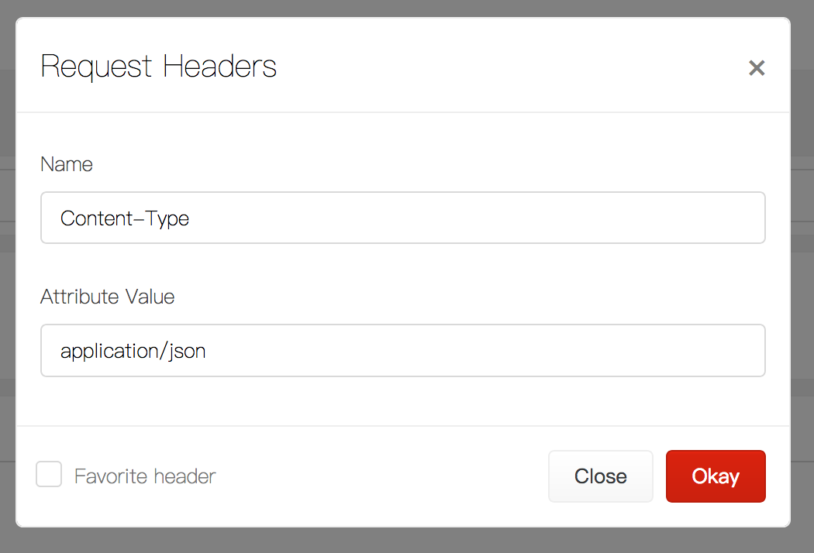

Al ejecutar una primera consulta, notamos que la base de datos ha sido inicializada sin datos:

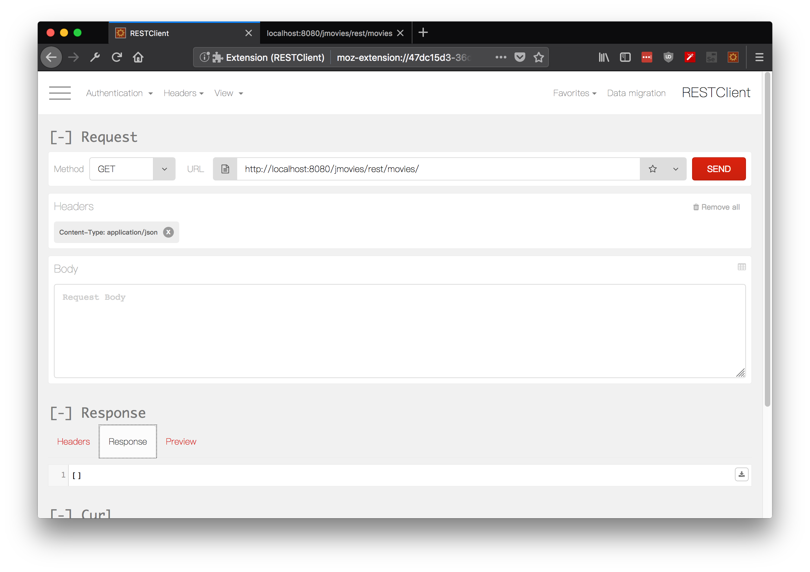

Prodecemos a insertar un primer dato utilizando POST:


Si lanzamos nuevamente una consulta GET, notaremos que los datos han sido insertados satisfactoriamente en la base de datos:

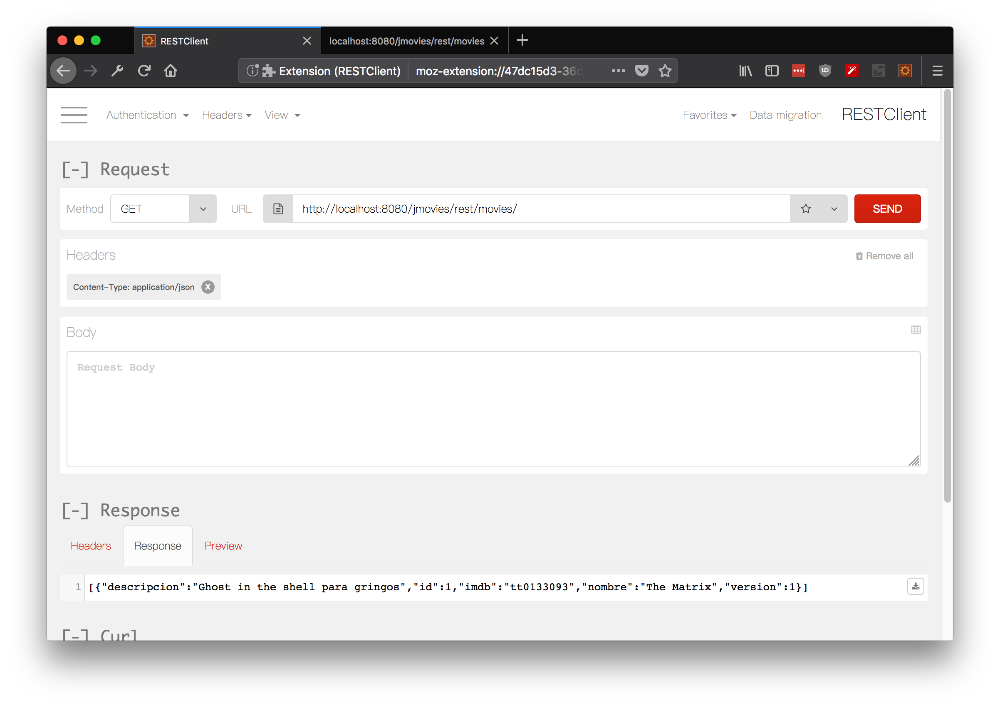

Luego podemos actualizar la entidad mediante PUT, note que tanto el id como la versión deben coincidir para poder actualizar satisfactoriamente:

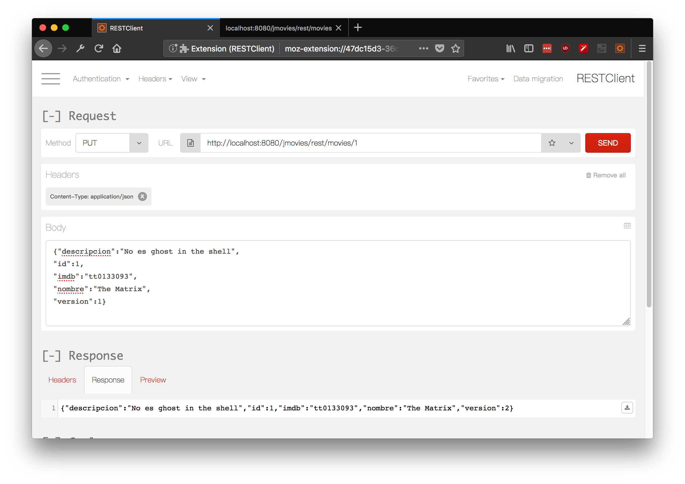

Observamos nuevamente que la actualización es satisfactoria:

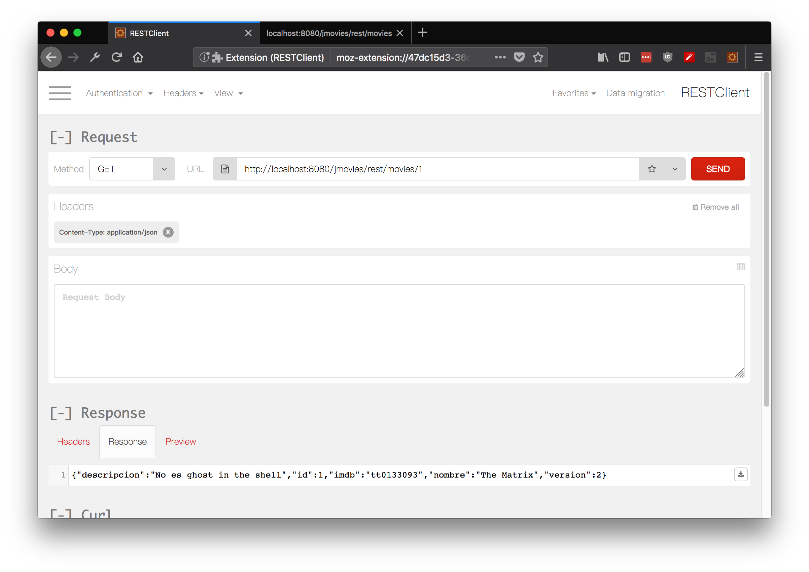

Si todas las pruebas son satisfactorias hasta este punto, hemos creado con éxito un backend compatible con cualquier framework SPA vue/angular/react/knockout/jet/etc. Para probar nuestro backend se ha preparado una aplicación con AngularJS en el [siguiente respositorio](https://github.com/tuxtor/jmovies-spa), basta con que copiemos el contenido del directorio dentro de la carpeta *src/main/webapp*.

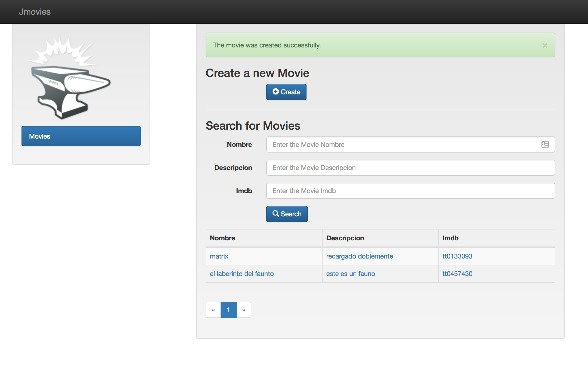

## Actualización de la aplicación desde Java EE 7 hacia Java EE 8

Nuevamente abrimos nuestro archivo pom.xml y buscamos la dependencia denominada javaee-api:

```xml
<dependency>
    <groupId>javax</groupId>
    <artifactId>javaee-api</artifactId>
    <version>7.0</version>
    <scope>provided</scope>
</dependency>
```

Reemplazamos la version

```xml
<dependency>
    <groupId>javax</groupId>
    <artifactId>javaee-api</artifactId>
    <version>8.0</version>
    <scope>provided</scope>
</dependency>
```

Listo, ya estamos en JavaEE 8, ¿Esperaban más? :). Commit de referencia `c01baf2`.

[Más información sobre la retrocompatibilidad garantizada de JavaEE](https://dzone.com/articles/testing-javaee-backward-and-forward-compatibility)

## Implementación de nuevas características en Java EE 8

### JSON-B

JSON-B es una nueva API para la personalización del proceso de Marshalling/Unmarshalling, denominada informalmente como JAX-B para el mundo JSON. La nueva API define anotaciones que anteriormente solo existitian en las implementaciones (Jackson, Gson), para controlar la creación de propiedades y documentos JSON, así como una simplificación con la interacción con JSON-P (Processig) y JAX-RS.

Como primera prueba modificaremos ligeramente nuestra entidad `Movie` para agregar una nueva propiedad, denominada `precioVenta` y utilizaremos las anotaciones `@JsonbProperty` y `@JsonbNumberFormat` para modificar declarativamente el Marshalling/Unmarshalling

```java
@Column
@NotNull
@JsonbProperty("nombre-pelicula")
private String nombre;

@Column
@Size(max = 2000)
private String descripcion;

@Column
private String imdb;

@Column
@JsonbProperty("precio-publico")
@JsonbNumberFormat("#0.00")
private Double precioVenta;
```

Al desplegar podemos realizar nuevamente la prueba de persistencia con la siguiente muestra, note que se incluye la nueva propiedad y la propiedad `nombre` fue alterada mediante JSON-B

```json
{
"nombre-pelicula":"The Matrix",
"imdb":"tt0133093",
"descripcion":"Ghost in the shell para gringos",
"precio-publico":"1050"
}
```

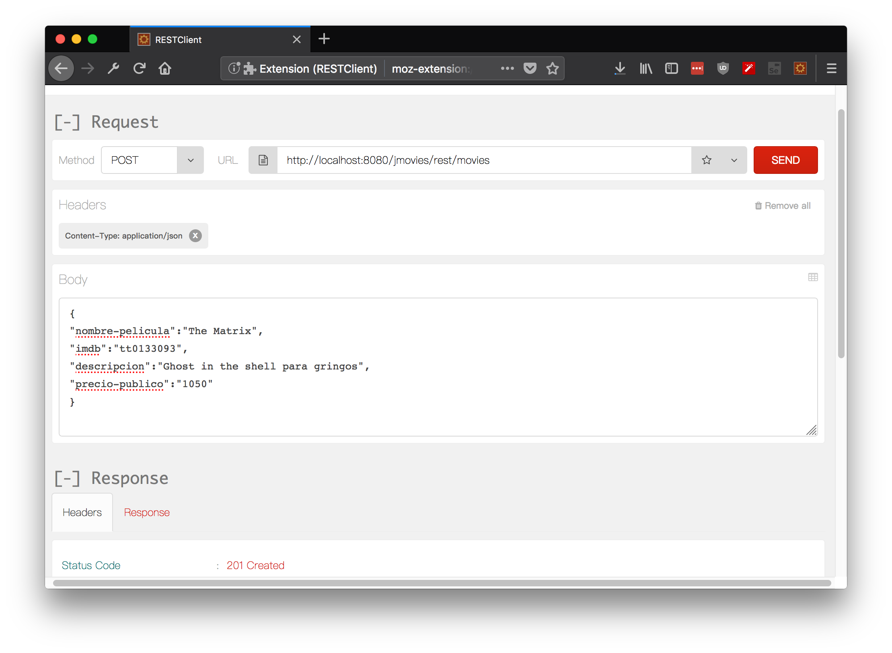
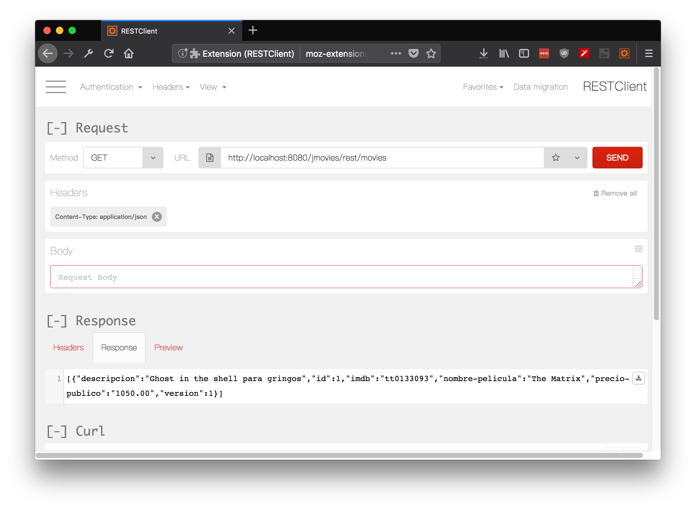

Como referencia visualizar el estado del proyecto en el commit `1b38184`.

### JSON-P Patch

JSON-P es una API que existe desde versiones anteriores de JavaEE 8 y fue actualizada con la inclusión de soporte a [JSON Pointer](https://tools.ietf.org/html/rfc6901) y [JSON Patch](http://jsonpatch.com/), para permitir manipulaciones de JSON directamente sobre el texto y sin realizar Marshalling hacia un objeto en Java.

Para probar esta característica agregaremos dos nuevos métodos a nuestro `MovieEndpoint`.

```java
@GET
@Path("/with-actors/{id:[0-9][0-9]*}")
public Response findWithActors(@PathParam("id") final Long id) {
    Movie movie = movieDao.findById(id);
    if (movie == null) {
        return Response.status(Status.NOT_FOUND).build();
    }

    return Response.ok(createMovieWithActor(movie)).build();
}

private String createMovieWithActor(Movie movie){

    //To json
    String result = JsonbBuilder.create().toJson(movie);

    JsonReader jsonReader = Json.createReader(new StringReader(result));
    JsonObject jobj = jsonReader.readObject();

    //Json-p Patch
    jobj = Json.createPatchBuilder()
        .add("/actores", "mafalda")
        .build()
        .apply(jobj);

    return jobj.toString();
}
```

Notese que mediante el método `createMovieWithActor` realizamos 1- Marshalling manual, 2- Unmarshalling hacia JsonObject y 3- Agregamos una nueva propiedad denominada actores, manipulando exclusivamente el objeto JSON. Posteriomente exponemos este método con una nueva ruta mediante `findWithActors`

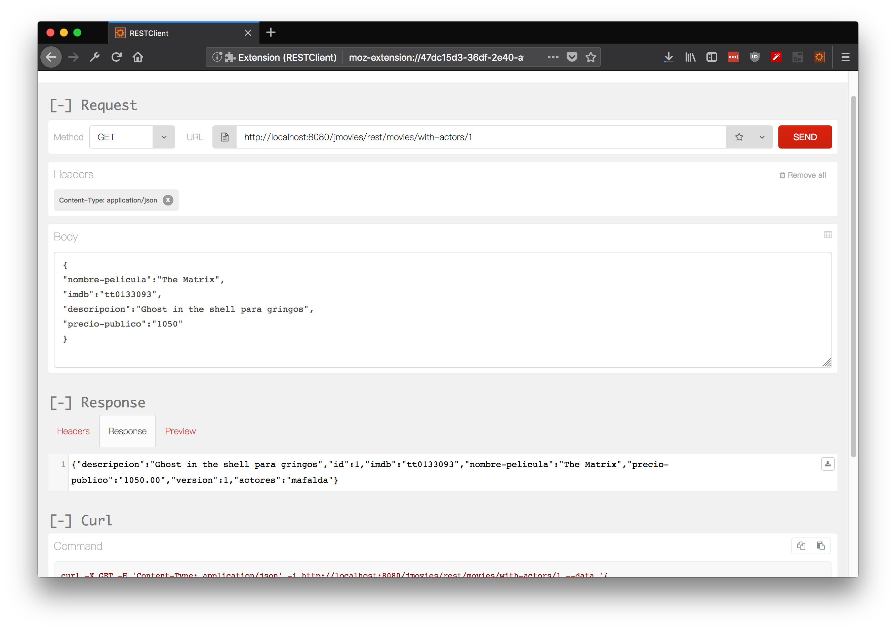

Como referencia visualizar el estado del proyecto en el commit `90b7de2`.

### JAX-RS Reactivo
Uno de los mayores cambios entre la publicación de JavaEE 7 y JavaEE 8 fue la popularización del manifiesto y consecuentemente de los clientes http reactivos, cambió que fue adoptado por JAX-RS.

Para probar esta caracteristica, crearemos un nuevo DAO que se comunicara vía REST para obtener los detalles de una película basándose unicamente en su código de IMDB. Para este ejercicio se requiere obtener una API key en [OMDB](http://www.omdbapi.com/).

```java
@Stateless
public class OmdbMovieDao {

    private static final String OMDB_KEY = "reemplazarporunallavefuncionalaca";
    private static final String OMDB_BASE_URL = "http://www.omdbapi.com/?apikey=" + OMDB_KEY;

    public CompletionStage<String> findActors(String imdb){

        String requestUrl = OMDB_BASE_URL + "&i=" + imdb;

        //Intentar buscar los detalles
        //Parametrizamos el cliente
        WebTarget target = ClientBuilder.newBuilder()
                .connectTimeout(2, TimeUnit.SECONDS)
                .readTimeout(2, TimeUnit.SECONDS)
                .build()
                .target(requestUrl);

        CompletionStage<String> future = target.request()
                .accept(MediaType.APPLICATION_JSON)
                .rx()
                .get(String.class);
        return future;
    }
}
```

A partir del DAO podemos observar que al construir nuestra petición utilizando .rx() y .get obtenemos como resultado un objeto de tipo CompletionStage. CompletionStage fue una de las nuevas APIs(y de hecho la única reactiva) integrada en Java 8, por lo que JavaEE 8 la adopta como su mecanismo para la evaluación de CompletableFutures y combinación de resultados entre distintos orígenes.

Al estar listo nuestro nuevo DAO, podemos inyectarlo en `MovieEndpoint` e integrarlo en el proceso de patching, para combinar los resultados almacenados en la base de datos, con los datos obtenidos desde OMDB de forma reactiva.

```java
@EJB
OmdbMovieDao omdbDao;

//Otros metodos

@GET
@Path("/with-actors/{id:[0-9][0-9]*}")
public void findWithActors(@PathParam("id") final Long id, @Suspended AsyncResponse response) {

    Movie movie = movieDao.findById(id);

    if (movie == null) {
        response.resume(new NotFoundException());
    }
    String movieString = JsonbBuilder.create().toJson(movie);

    CompletionStage<String> omdbInfo = omdbDao.findActors(movie.getImdb());

    omdbInfo.thenApply((omdbResponse) -> {

        JsonReader orgMovieJsonReader = Json.createReader(new StringReader(movieString));
        JsonObject orgMovie = orgMovieJsonReader.readObject();

        JsonReader omdbJsonReader = Json.createReader(new StringReader(omdbResponse));
        JsonObject omdbMovie = omdbJsonReader.readObject();

        //Json-p Patch
        orgMovie = Json.createPatchBuilder()
            .add("/actores", omdbMovie.getString("Actors", "mafalda"))
            .build()
            .apply(orgMovie);

        return orgMovie.toString();
    })
    .thenAccept(response::resume);
}
```

La respuesta deberá ser transparente al usuario, dependiendo de la velocidad de la conexión se observara que la respuesta sera generada solo al completar la petición hacia OMDB, "reaccionando" a este evento y parchando el JSON original con la nueva información.

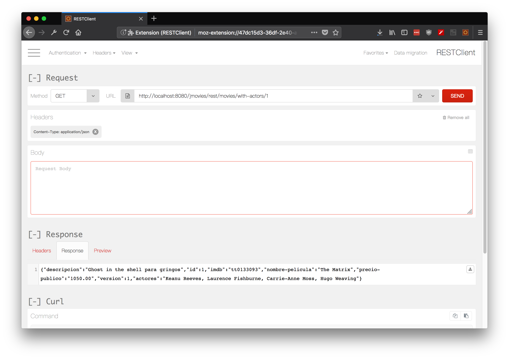

### CDI 2.0 (Async events)

Una de las características bastante utilizadas mediante CDI es la creación de eventos y listener, mediante los cuales un componente puede disparar un evento y podemos declarar un método que reacciona al evento. Para probar esta característica necesitaremos:

#### Agregar soporte a CDI

Podemos utilizar el asistente de NetBeans para generar un archivo `beans.xml`, el cual activara CDI en todo el proyecto:

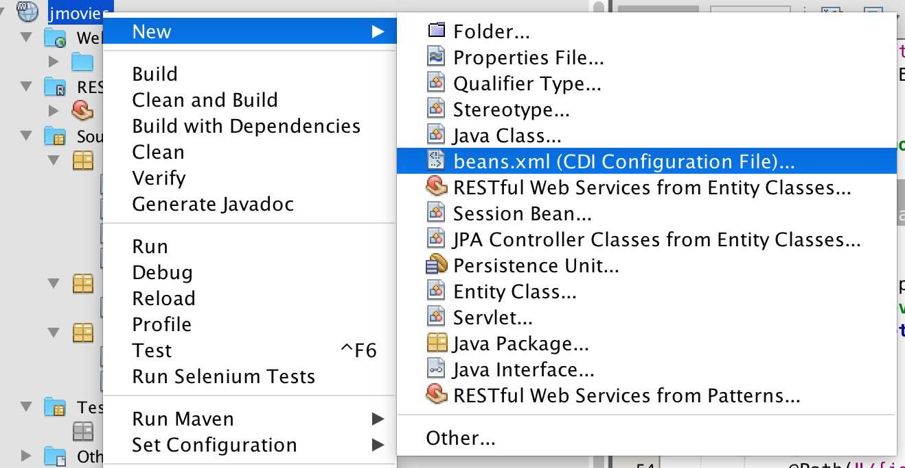

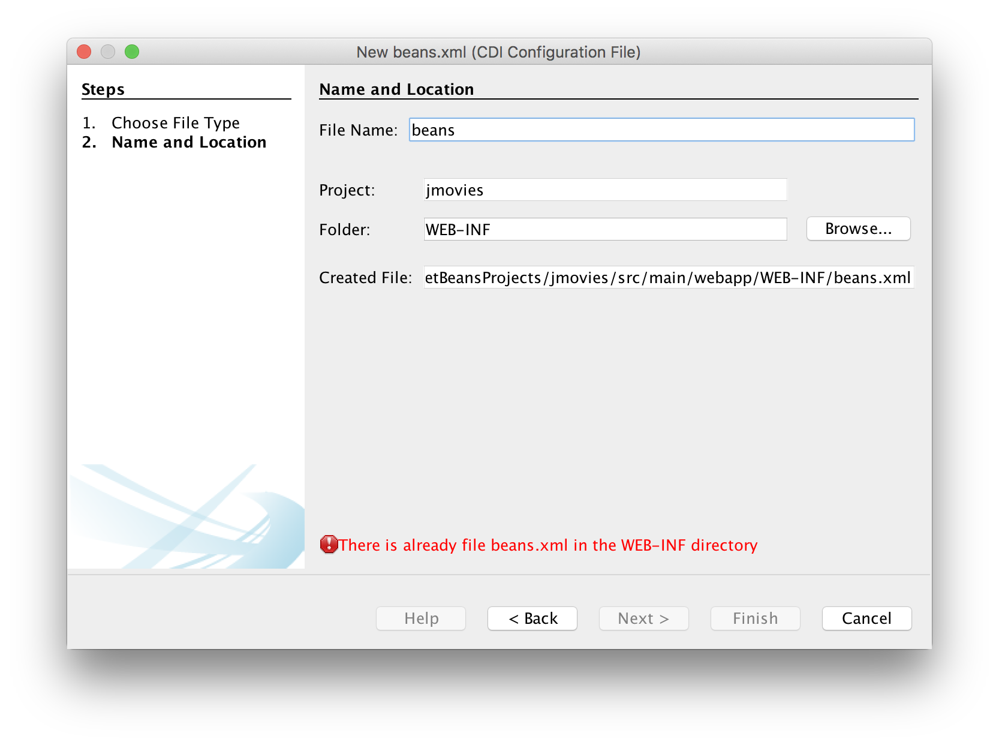

#### Agregar un bean que reaccione a los eventos y el evento

La primera pieza de nuestro evento sera un observador con CDI, el método solo genera información en la salida estandard *despues* de una pausa de 5 segundos, a pesar que nuestro evento sera reactivo, el mismo aun es de tipo blocking por lo que se ejecutara en el mismo thread que dispare el evento.

```java
@Named
public class OmdbMovieObserver {
    public void logMovieLookup(@Observes String imdb){
        try {
            Thread.sleep(10000);
        } catch (InterruptedException ex) {
            Logger.getLogger(OmdbMovieObserver.class.getName()).log(Level.SEVERE, null, ex);
        }
        System.out.println("Buscando " + imdb);
    }
}
```

Luego, dentro de `OmdbDao` agregaremos el evento el cual en este momento aun es de tipo blocking

```java
@Inject
Event<String> lookupMovie;

public CompletionStage<String> findActors(String imdb){

    lookupMovie.fire(imdb);
    //....
```

Al probar nuevamente el API notaremos que el evento se queda bloqueado después de emitir el evento, por lo que respuesta tardara como mínimo 10 segundos más el tiempo en bajar a la base de datos y consultar a OMDB.

Como referencia visualizar el estado del proyecto en el commit `96e4f18`.

#### Agregar un observador asíncrono

Para corregir la situación anterior, cambiaremos el observador hacia un observador asíncrono

`public void logMovieLookup(@ObservesAsync String imdb)`

Y también la generación del evento para que el mismo sea asíncrono y utilice su propio thread. Al estar en un application server, también necesitamos de un `ManagedExecutorService` para la gestión del nuevo thread donde se ejecuta el evento en CDI. Utilizaremos el disponible por defecto en Payara.

```java
public class OmdbMovieDao {

    @Inject
    Event<String> lookupMovie;

    @Resource
    ManagedExecutorService threadPool;

    public CompletionStage<String> findActors(String imdb){

        lookupMovie.fireAsync(imdb, NotificationOptions.ofExecutor(threadPool));

    //....
```

Al probar nuevamente nuestra API notaremos que el evento CDI se ejecutó en background y no bloquea más la comunicación.


Como referencia visualizar el estado del proyecto en el commit `2d722bd`.
